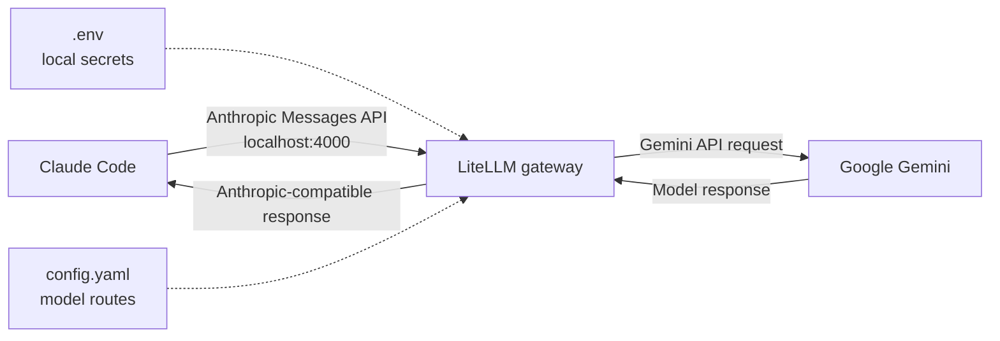
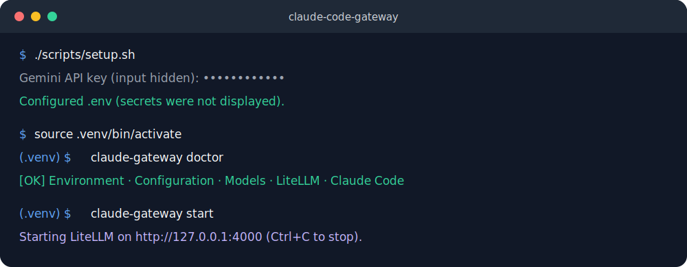

# Claude Code Gateway

Use [Claude Code](https://docs.anthropic.com/en/docs/claude-code/overview) with Google
Gemini—and, with a small configuration change, any provider supported by
[LiteLLM](https://docs.litellm.ai/).

This project runs a private gateway on your computer. Claude Code sends Anthropic-format
requests to the gateway, LiteLLM translates them to the selected provider's API, and the
provider returns the response. The default configuration uses Google's stable
`gemini-3.1-flash-lite` model through the Gemini API.

> [!IMPORTANT]
> This is an independent community project. It is not affiliated with Anthropic, Google, or
> LiteLLM. LiteLLM is a third-party gateway and model compatibility can vary by feature.

## Why this project?

- **One-time secret setup** — save the Gemini key once; never export it for every terminal.
- **One-command launch** — start LiteLLM, wait for readiness, configure Claude Code, and clean
  up the proxy when Claude exits.
- **Cross-platform** — one Python implementation with convenience scripts for Windows, macOS,
  and Linux.
- **Safe local defaults** — loopback-only listener, generated proxy token, disabled LiteLLM
  telemetry, and no prompt logging configured.
- **Actionable diagnostics** — `claude-gateway doctor` checks Python, secrets, configuration,
  model aliases, executables, and network exposure without printing credentials.
- **Provider-ready** — add a LiteLLM model entry and choose its alias; no launcher code changes.

## How it works



The Gemini key is available only to the LiteLLM process. Claude Code receives the generated
local proxy token, not the provider credential.



## Supported models and providers

The default route is:

| Gateway alias | Provider model | Status | Best for |
| --- | --- | --- | --- |
| `gemini-3.1-flash-lite` | `gemini/gemini-3.1-flash-lite` | Included | Fast, cost-efficient coding assistance |

Google lists `gemini-3.1-flash-lite` as a stable model. Availability, pricing, quotas, and
retirement dates can change, so check the [Gemini model documentation](https://ai.google.dev/gemini-api/docs/models/gemini-3.1-flash-lite)
before depending on it.

Provider examples are included for:

| Provider | Included by default | Example |
| --- | ---: | ---: |
| Google Gemini API / AI Studio | Yes | — |
| OpenAI | No | [`examples/providers/openai.yaml`](examples/providers/openai.yaml) |
| OpenRouter | No | [`examples/providers/openrouter.yaml`](examples/providers/openrouter.yaml) |
| Ollama (local) | No | [`examples/providers/ollama.yaml`](examples/providers/ollama.yaml) |
| Anthropic | No | [`examples/providers/anthropic.yaml`](examples/providers/anthropic.yaml) |
| Google Vertex AI | No | [`examples/providers/vertex-ai.yaml`](examples/providers/vertex-ai.yaml) |
| Azure OpenAI | No | [`examples/providers/azure-openai.yaml`](examples/providers/azure-openai.yaml) |

LiteLLM supports many more providers. “Supported by LiteLLM” does not guarantee every Claude
Code feature will translate perfectly; tool use, extended thinking, prompt caching, images,
and beta headers depend on the selected model and adapter. See [Adding a provider](docs/providers.md)
before switching.

## Prerequisites

You need:

1. **Python 3.10 or newer.** Check with `python --version` (Windows) or
   `python3 --version` (macOS/Linux).
2. **Claude Code.** Follow Anthropic's [installation guide](https://docs.anthropic.com/en/docs/claude-code/getting-started),
   then run `claude doctor`.
3. **A Gemini API key.** Create one in [Google AI Studio](https://aistudio.google.com/app/apikey).
   API usage may require billing and is governed by Google's terms and data policies.
4. **Git** to clone and update the project.

## Quick start

### macOS and Linux

```bash
git clone https://github.com/Yourstruggle11/claude-code-gateway.git
cd claude-code-gateway
chmod +x scripts/*.sh
./scripts/setup.sh
source .venv/bin/activate
claude-gateway doctor
claude-gateway claude
```

`setup.sh` creates `.venv`, installs pinned runtime dependencies, and prompts once for the
Gemini API key. Input is hidden. Accept the VS Code configuration prompt to create safe
project-local Claude Code settings automatically. Activate `.venv` in each new terminal, then
use the short `claude-gateway` commands.

### Windows PowerShell

```powershell
git clone https://github.com/Yourstruggle11/claude-code-gateway.git
Set-Location claude-code-gateway
.\scripts\setup.ps1
.venv\Scripts\Activate.ps1
claude-gateway doctor
claude-gateway claude
```

If local policy blocks project scripts, use the process-scoped alternative (it does not change
the machine policy):

```powershell
powershell -NoProfile -ExecutionPolicy Bypass -File .\scripts\setup.ps1
.venv\Scripts\Activate.ps1
claude-gateway doctor
claude-gateway claude
```

### Windows Git Bash

Git Bash uses forward slashes, even on Windows:

```bash
git clone https://github.com/Yourstruggle11/claude-code-gateway.git
cd claude-code-gateway
powershell.exe -NoProfile -ExecutionPolicy Bypass -File ./scripts/setup.ps1
source .venv/Scripts/activate
claude-gateway doctor
claude-gateway claude
```

Do not use PowerShell paths such as `.\.venv\Scripts\...` in Git Bash. Once the prompt shows
`(.venv)`, call `claude-gateway` directly.

The gateway stops automatically when Claude Code exits. Press <kbd>Ctrl</kbd>+<kbd>C</kbd> to
stop either process.

## Installation without helper scripts

Use this path if you prefer to see each step or if a shell wrapper does not work:

```bash
python -m venv .venv
```

Activate the environment:

```bash
# macOS/Linux
source .venv/bin/activate

# Windows Git Bash
source .venv/Scripts/activate
```

```powershell
# Windows PowerShell
.venv\Scripts\Activate.ps1
```

Then install and configure:

```bash
python -m pip install --editable .
claude-gateway setup
claude-gateway doctor
claude-gateway claude
```

For a standalone proxy, run `claude-gateway start`. This preserves the old project's behavior
without launching Claude Code.

## Use with the Claude Code VS Code extension

The extension runs inside VS Code, so use the standalone gateway instead of
`claude-gateway claude`.

1. Install the official **Claude Code** extension published by Anthropic.
2. Activate the project environment in VS Code's integrated terminal:

   ```bash
   # macOS/Linux
   source .venv/bin/activate

   # Windows Git Bash
   source .venv/Scripts/activate
   ```

   ```powershell
   # Windows PowerShell
   .venv\Scripts\Activate.ps1
   ```

3. Configure the extension. If you accepted the prompt during `claude-gateway setup`, this is
   already done. Otherwise run:

   ```bash
   claude-gateway configure-vscode
   ```

   The command merges gateway values into `.claude/settings.local.json`, backs up an existing
   file before changing it, preserves unrelated settings, and never prints the token. Preview
   the operation without writing:

   ```bash
   claude-gateway configure-vscode --dry-run
   ```

   Project-local scope is recommended because its token and URL belong to this clone. To apply
   the gateway to every project for the current user, explicitly run
   `claude-gateway configure-vscode --scope user` instead.

4. In VS Code settings under **Extensions → Claude Code**, enable **Disable Login Prompt** for
   this third-party provider setup.

5. Confirm the installation, then start the proxy:

   ```bash
   claude-gateway doctor
   claude-gateway start
   ```

6. Keep that terminal open. Open Claude Code from the VS Code sidebar and start a conversation.
   Press
   <kbd>Ctrl</kbd>+<kbd>C</kbd> in the gateway terminal when finished.

Do not run `claude-gateway start` and `claude-gateway claude` together; both use port 4000 by
default. Remove only the settings managed by this project with
`claude-gateway configure-vscode --remove`.

## Commands

| Command | Purpose |
| --- | --- |
| `claude-gateway setup` | Save the Gemini key and generate a strong local proxy token |
| `claude-gateway configure-vscode` | Merge project-local Claude Code gateway settings safely |
| `claude-gateway doctor` | Validate the installation without sending an API request |
| `claude-gateway start` | Run only LiteLLM in the foreground |
| `claude-gateway claude` | Run LiteLLM and Claude Code together |
| `claude-gateway --help` | Show all options |

Pass Claude Code arguments after `--`, for example:

```bash
claude-gateway claude -- --model gemini-3.1-flash-lite
```

## Configuration

`config.yaml` is intentionally small: it defines public model aliases, upstream LiteLLM model
IDs, environment-based credentials, parameter translation, and proxy authentication. Secrets
never belong in YAML.

Common local settings live in `.env`:

| Variable | Required | Default | Meaning |
| --- | ---: | --- | --- |
| `GEMINI_API_KEY` | Yes for default config | — | Provider credential from Google AI Studio |
| `LITELLM_MASTER_KEY` | Yes | generated | Token accepted by the local gateway |
| `GATEWAY_MODEL` | No | `gemini-3.1-flash-lite` | Main LiteLLM alias used by Claude Code |
| `GATEWAY_SMALL_MODEL` | No | main model | Fast/background LiteLLM alias |
| `GATEWAY_HOST` | No | `127.0.0.1` | Listen address; keep loopback for local use |
| `GATEWAY_PORT` | No | `4000` | Listen port |
| `GATEWAY_CONFIG` | No | `config.yaml` | Alternate LiteLLM configuration path |

Environment variables already set by the parent shell take precedence over `.env`. Command-line
`--host`, `--port`, and `--config` options take precedence over both. Every option and the Claude
Code variables injected by the launcher are documented in [Configuration](docs/configuration.md).

## Troubleshooting

Start with:

```bash
claude-gateway doctor
```

### `claude-gateway` is not recognized

Activate the project virtual environment, then retry:

```bash
# macOS/Linux
source .venv/bin/activate

# Windows Git Bash
source .venv/Scripts/activate
```

```powershell
# Windows PowerShell
.venv\Scripts\Activate.ps1
```

```bash
claude-gateway doctor
```

If activation is unavailable, call the executable explicitly using syntax for the current shell:

```bash
# macOS/Linux
./.venv/bin/claude-gateway doctor

# Windows Git Bash
./.venv/Scripts/claude-gateway.exe doctor
```

```powershell
# Windows PowerShell
.\.venv\Scripts\claude-gateway.exe doctor
```

If the executable is absent, rerun the setup script.

### Port 4000 is already in use

Choose another port for the session:

```bash
claude-gateway claude --port 4100
```

Or add `GATEWAY_PORT=4100` to `.env`.

### Authentication or 401 error

Run `claude-gateway setup --force` to replace both credentials, then retry. Do not paste the
key into an issue. Confirm the Gemini key is enabled and belongs to a project with the required
quota or billing.

### Model not found

The value of `GATEWAY_MODEL` must exactly match a `model_name` in `config.yaml`. Provider model
IDs also change over time. Check the provider's model page and LiteLLM adapter documentation.

### PowerShell refuses to run a script

Use the process-scoped `-ExecutionPolicy Bypass` command shown in Quick start, or follow the
manual installation path. Do not weaken the system-wide policy for this project.

### Claude Code launches but requests fail

Run the proxy alone with `claude-gateway start` and inspect its error. Avoid debug logging when
working with sensitive code: detailed logs can contain prompts or model responses. Also update
Claude Code and run `claude doctor`.

## FAQ

### Is Claude Code using my Anthropic subscription?

No. The launcher points Claude Code at the local LiteLLM endpoint. Provider usage is billed and
governed by the provider configured in `config.yaml`.

### Why does Claude Code still use Anthropic-named environment variables?

Claude Code speaks Anthropic's API format. `ANTHROPIC_BASE_URL` selects the compatible gateway;
it does not determine the upstream model provider.

### Where is my API key stored?

In the ignored `.env` file inside this clone. It is loaded only into child process environment.
For shared or production systems, use a real secret manager instead of `.env`.

### What if I already have `~/.claude/settings.json`?

The recommended local wizard does not modify it. It writes this clone's gateway values to
`.claude/settings.local.json`, so your unrelated user preferences remain untouched. If the user
file already contains old gateway tokens or URLs, remove those stale entries to avoid affecting
other projects. Use `claude-gateway configure-vscode --scope user` only when you intentionally
want this gateway available in every project; the command merges values and creates a backup.

### Can I configure different main and fast models?

Yes. Add both aliases to `config.yaml`, then set `GATEWAY_MODEL` and `GATEWAY_SMALL_MODEL` in
`.env`. Both aliases are validated before launch.

### Can other applications call this gateway?

Yes. Run `claude-gateway start` and use LiteLLM's OpenAI- or Anthropic-compatible endpoints with
`LITELLM_MASTER_KEY`. Keep the listener local unless you have added TLS, network controls, and
production-grade secret management.

### Is this production deployment infrastructure?

No. “Production-quality repository” here means maintained code, tests, documentation, and safe
local defaults. A shared service needs TLS, managed secrets, authentication lifecycle, audit and
retention policy, rate limits, monitoring, backups, and a supported deployment target.

## Security

- Never commit `.env`; CI and pre-commit checks help, but they cannot recover a leaked key.
- The default listener is `127.0.0.1`. Binding to `0.0.0.0` exposes the proxy to your network.
- The generated proxy token protects the endpoint but does not make plain HTTP safe over a
  network.
- Requests contain source code, prompts, file contents, and tool results. Review LiteLLM and the
  selected provider's data handling before use.
- Default telemetry is disabled by the launcher. No observability callback or request/response
  logging is configured.
- Rotate a key immediately if it appears in terminal history, logs, screenshots, or a commit.

Report vulnerabilities privately as described in [SECURITY.md](SECURITY.md).

## Updating

```bash
git pull --ff-only

# macOS/Linux
.venv/bin/python -m pip install --editable .

# Windows PowerShell
.venv\Scripts\python.exe -m pip install --editable .
```

Review [CHANGELOG.md](CHANGELOG.md) and compare local `config.yaml` changes before updating. Run
`claude-gateway doctor` afterward. Dependency versions are pinned or bounded for reproducibility;
Dependabot proposes tested upgrades.

## Uninstalling

Stop the gateway, then remove the cloned directory. That removes the virtual environment, `.env`,
generated proxy token, and project code. The project does not install a service or alter global
Claude Code settings. Claude Code and Python are separate installations and are not removed.

Before deletion, revoke the Gemini API key in Google AI Studio if it will no longer be used.

## Contributing

Bug reports, documentation fixes, provider examples, and focused code improvements are welcome.
Read [CONTRIBUTING.md](CONTRIBUTING.md), run the quality checks, and never include real prompts or
credentials in fixtures or issue reports.

## License

[MIT](LICENSE)
